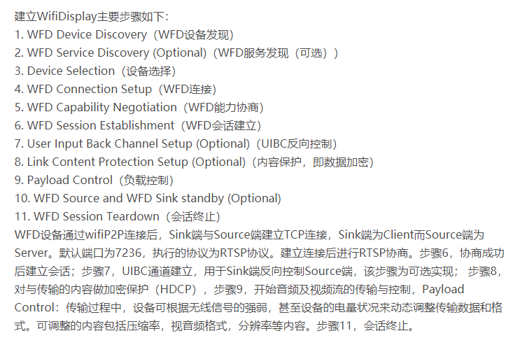
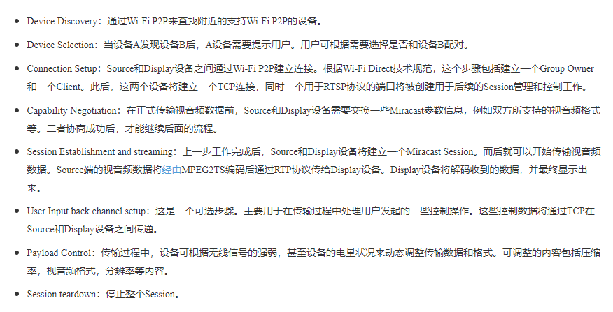
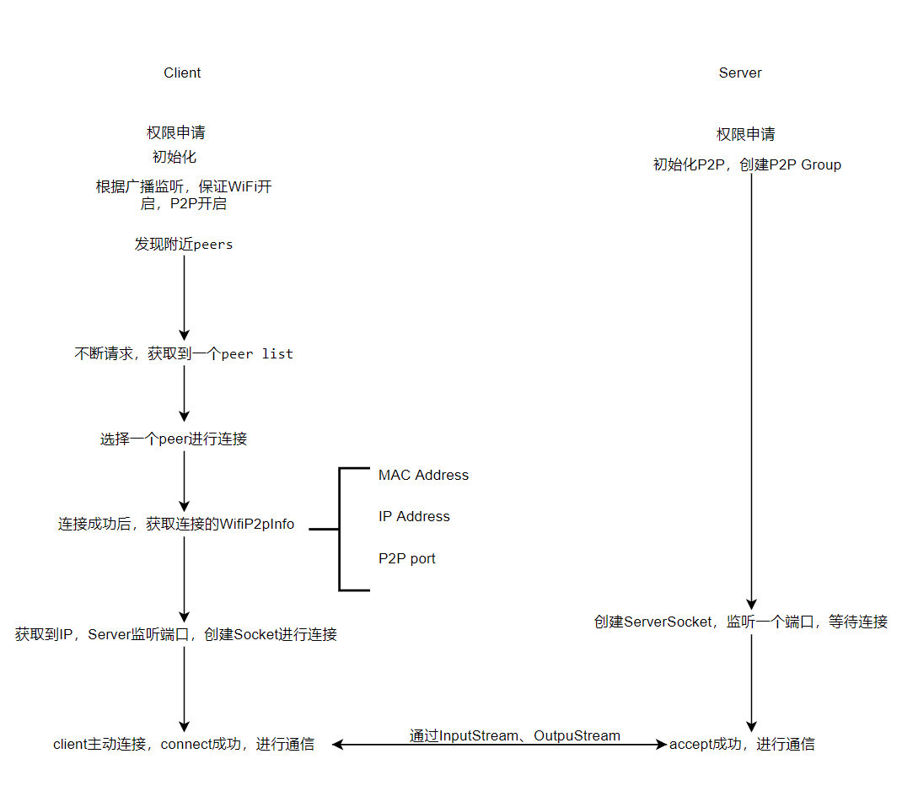

[toc]


# Android WiFi Display (Miracast)

**投屏技术协议**：

> DLNA：Digital Living Network Alliance，PC、移动设备、消费电器之间互联互通的协议
>
> AirPlay：苹果开发的无线技术，通过WiFi传输，支持DLNA没有的镜像（设备显示什么，显示屏幕也显示什么）
>
> Miracast：以WiFi Direct为基础的无线显示标准

DLNA

蓝牙：蓝牙发现

WiFi Direct：WiFi直连

Nsd：网络服务发现

## 技术体系：


1. WiFi Direct：WiFi P2P，支持在没有AP（Access Point）下，WiFi设备直连并通信
2. WiFi Protected Setup：用于用户自动配置WiFi网络、添加WiFi设备
3. 11n/WMM/WPA2：11n是802.11n协议（56M提升至600M）；WMM是WiFi Multimedia，针对实时视音频数据的QoS服务；WPA2是WiFi Protected Acess2，传输加密保护


- WiFi Display相关Service：

> MediaPlayerService及相关模块：RTP/RTSP及相应的编解码技术
>
> SurfaceFlinger及相关模块：SurfaceFlinger是将各层UI数据混屏并投递到显示设备中去显示
>
> WindowManagerService及相关模块：用于管理系统中各个UI层的位置和属性
>
> DisplayManagerService：用于管理系统显示设备的生命周期，包括物理屏幕、虚拟屏幕、WiFi Display
>
> WifiService及相关模块：WifiDisplay建立在P2P基础上
>
> MediaRouterService：管理各个应用程序的多媒体播放的行为
>
> MediaRouter：用于和MediaRouterService交互一起管理多媒体的播放行为，并维护当前已经配对上的remote display设备，包括WiFi Display、蓝牙A2DP、chromecast设备
>
> WifiDisplayAdapter：用于DisplayManagerService管理WiFi Display显示的Adapter
>
> WifiDisplayController：用于控制扫描wifi display设备、连接、断开等操作


Android中关注：WiFi Direct（WifiP2pService管理和控制），WiFi Multimedia


Miracast工作流程：






SurfaceFlinger对Miracast的支持


Wifi P2P：[Android wifi探究三：Wifi P2P 连接附近设备]( https://blog.csdn.net/u011913612/article/details/52795464 )


## 流媒体协议

1. RTP：Real-time Transport Protocol，传送具有实时属性的数据，建立在UDP上，不保证传送或防止无序传送，允许接收方重组发送方的包序列（例子：视频解码，就不需要顺序解码）
2. RTCP：Real-time Transport Control Protocol，RTP的控制协议，监控服务质量并传送正在进行的会话参与者的相关信息；为RTP媒体流提供信道外控制
3. SRTCP：Secure Real-time Transport Protocol，在RTP基础上定义的一个协议，用于为单播和多播应用程序中的实时传输协议的数据提供加密、消息认证、完整性保护和重放保护
4. RTSP：Real-time Streaming Protocol，控制声音或影像的多媒体串流协议，并允许同时多个串流需求控制； 该协议目的在于控制多个数据发送连接，为选择发送通道，如UDP、多播UDP与TCP提供途径，并为选择基于RTP上发送机制提供方法 ；RTSP是双向实时数据传输协议，允许客户端向服务端发送请求（如回放、快进、倒退等）；（**算是在应用层协议？？？？**）
5. SDP：会话描述协议

 **RTSP发起/终结流媒体、RTP传输流媒体数据 、RTCP对RTP进行控制，同步** 

[RTP/RTSP/RTCP]( https://www.zhihu.com/question/20278635 )


## P2P使用demo



### client端

- 权限申请和检查：

    ```xml
    <uses-permission android:name="android.permission.ACCESS_COARSE_LOCATION" />
    <uses-permission android:name="android.permission.ACCESS_FINE_LOCATION" />
    
    <!--Wifi P2P 权限一定要有，不然获取不到-->
    <uses-permission android:name="android.permission.ACCESS_WIFI_STATE" />
    <uses-permission android:name="android.permission.CHANGE_WIFI_STATE" />
    <uses-permission android:name="android.permission.CHANGE_NETWORK_STATE" />
    <uses-permission android:name="android.permission.INTERNET" />
    <uses-permission android:name="android.permission.ACCESS_NETWORK_STATE" />
    
    <uses-permission android:name="android.permission.READ_PHONE_STATE" />
    <uses-feature android:name="android.hardware.wifi.direct" android:required="true"/>
    ```

    部分权限根据API需要动态申请，如WiFi的状态和打开、位置信息的获取

- 初始化P2P设备，注册广播监听器：

    ```kotlin
    val intentFilter = IntentFilter().apply {
        addAction(WifiP2pManager.WIFI_P2P_STATE_CHANGED_ACTION)
            addAction(WifiP2pManager.WIFI_P2P_PEERS_CHANGED_ACTION)
            addAction(WifiP2pManager.WIFI_P2P_CONNECTION_CHANGED_ACTION)
            addAction(WifiP2pManager.WIFI_P2P_THIS_DEVICE_CHANGED_ACTION)
    }
    registerReceiver(mReceiver, intentFilter)
    mWifiP2pManager = getSystemService(Context.WIFI_P2P_SERVICE) as WifiP2pManager
    // 用这个通道来查找和连接P2P设备 在 WLAN P2P 框架中注册您的应用
    mChannel = mWifiP2pManager?.initialize(this, mainLooper) { Log.d(localClassName, "channel disconnected") }
    // 查找附近P2P设备
    mWifiP2pManager?.discoverPeers(mChannel, object : WifiP2pManager.ActionListener {
        override fun onSuccess() {
            Log.d(localClassName, "discoverPeers onSuccess")
        }
    
        override fun onFailure(reason: Int) {
            Log.w(localClassName, "discoverPeers onFailure:$reason")
        }
    })
    ```

    

- 广播接收：

    - 保证P2P打开：

        ```kotlin
        WifiP2pManager.WIFI_P2P_STATE_CHANGED_ACTION -> {
            when (intent.getIntExtra(WifiP2pManager.EXTRA_WIFI_STATE, -1)) {
                WifiP2pManager.WIFI_P2P_STATE_ENABLED -> {
                    // Wifi P2P is enabled
                    Log.d(localClassName, "P2P is enabled")
                }
                else -> {
                    // Wi-Fi P2P is not enabled
                    Log.d(localClassName, "P2P is not enabled")
                }
            }
        }
        ```

        

    - 得到附近所有的支持P2P的设备peers：

        ```kotlin
        WifiP2pManager.WIFI_P2P_PEERS_CHANGED_ACTION -> {
            Log.d(localClassName, "可用的peer list发生改变")
            mWifiP2pManager?.requestPeers(mChannel) { peers -> availablePeers(peers) }
        }
        
        private fun availablePeers(peers: WifiP2pDeviceList?) {
            Log.d(localClassName, "size:${peers?.deviceList?.size}")
            mAdapter.clear()
            peers?.deviceList?.forEach { wifiP2pDevice ->
        		val name = wifiP2pDevice.deviceName
        		val address = wifiP2pDevice.deviceAddress
        		val status = when(wifiP2pDevice.status) {
        			WifiP2pDevice.CONNECTED -> "connected"
        			WifiP2pDevice.INVITED -> "invited"
        			WifiP2pDevice.FAILED -> "failed"
        			WifiP2pDevice.AVAILABLE -> "available"
        			WifiP2pDevice.UNAVAILABLE -> "unavailable"
        			else -> "unknown"
        		}
        		mAdapter.add("$name : $status\n$address")
        	}
            mAdapter.notifyDataSetChanged()
        }
        ```

        

    - 选择连接：

        ```kotlin
        val str = mAdapter.getItem(position)
        val strs = str?.split('\n')
        val address = strs?.get(1)
        Log.d(localClassName, "item click: $str address: $address")
        // val wifiP2pDevice = mPeers?.get(address)
        val config = WifiP2pConfig()
        config.deviceAddress = address
        config.wps.setup = WpsInfo.PBC
        mWifiP2pManager?.connect(mChannel, config, object : WifiP2pManager.ActionListener {
            override fun onSuccess() {
                Log.d(localClassName, "connect onSuccess")
            }
        
            override fun onFailure(reason: Int) {
                Log.w(localClassName, "connect onFailure:$reason")
            }
        })
        ```

        

    - 连接成功后，获取连接的WifiP2pInfo：

        ```kotlin
        WifiP2pManager.WIFI_P2P_CONNECTION_CHANGED_ACTION -> {
            Log.d(localClassName, "P2P连接状态发生改变")
            // 可以直接通过intent拿到WifiP2pGroup WifiP2pInfo
            // val group = intent.getParcelableExtra<WifiP2pGroup>(WifiP2pManager.EXTRA_WIFI_P2P_GROUP)
            // 也可以通过request去获取
            // mWifiP2pManager.requestNetworkInfo(mChannel) { networkInfo ->
            //     Log.d(localClassName, "networkInfo:$networkInfo")
            // }
            val networkInfo = intent.getParcelableExtra<NetworkInfo>(WifiP2pManager.EXTRA_NETWORK_INFO)
            networkInfo?.takeIf { it.isConnected }?.let {
                mWifiP2pManager?.requestGroupInfo(mChannel) { wifiP2pGroup ->
        			val wifiP2pDevices = wifiP2pGroup.clientList
                    val wifiP2p2DeviceOwner = wifiP2pGroup.owner
                    Log.d(localClassName, "group p2pInfo:$wifiP2pGroup")
                    tv_client_connected.post { tv_client_connected.text = wifiP2pGroup.networkName }
                }
                mWifiP2pManager?.requestConnectionInfo(mChannel) { wifiP2pInfo: WifiP2pInfo? ->
                    mWifiP2pInfo = wifiP2pInfo
                    Log.d(localClassName, "wifi p2pInfo $mWifiP2pInfo")
                    mWifiP2pInfo?.let {
                    	if (it.groupFormed && it.isGroupOwner) {
                           Toast.makeText(this@WifiP2PClientActivity, "can be connected", Toast.LENGTH_SHORT).show()
                       	} else if (it.groupFormed) {
                           Log.d(localClassName, "The other device acts as the client. In this case, we enable the get file button")
                        }
                   	}
                }
            }
        }
        ```

        

    - 获取IP，创建Socket进行连接Server端：

        ```kotlin
        val fileUri = extras?.getString(EXTRAS_FILE_PATH)
        val host = extras?.getString(EXTRAS_GROUP_OWNER_ADDRESS)
        val port = extras?.getInt(EXTRAS_GROUP_OWNER_PORT)
        if (fileUri == null || host == null || port == null) {
            Log.e(javaClass.name, "fileUri: $fileUri, host: $host, port: $port")
            return
        }
        val socket = Socket()
        try {
            Log.d(javaClass.name, "opening client socket")
            socket.bind(null)
            socket.connect(InetSocketAddress(host, port), SOCKET_TIME_OUT)
            Log.d(javaClass.name, "client socket:${socket.isConnected}")
            val outputStream = socket.getOutputStream()
            val contentResolver = applicationContext.contentResolver
            var inputStream: InputStream? = null
            try {
                inputStream = contentResolver.openInputStream(Uri.parse(fileUri))
            } catch (e: FileNotFoundException) {
                Log.e(javaClass.name, "file not found exception", e)
            }
            inputStream?.let {
                StreamUtil.copyFile(it,outputStream)
            }
            Log.d(javaClass.name, "Client data written")
        } catch (e: IOException) {
            Log.e(javaClass.name, "client socket error", e)
        } finally {
            socket.takeIf { it.isConnected }?.apply {
                try {
                    close()
                } catch (e: IOException) {
                    Log.e(javaClass.name, "client socket close error", e)
                }
            }
        }
        ```

        

    - 断开连接：

        ```kotlin
        mWifiP2pManager?.removeGroup(mChannel, object : WifiP2pManager.ActionListener {
            override fun onSuccess() {
                Log.d(localClassName, "disconnect success")
            }
        
            override fun onFailure(reason: Int) {
                Log.w(localClassName, "disconnect failed:$reason")
            }
        })
        ```

### Server端

- 权限申请：

    ```xml
    <uses-permission android:name="android.permission.ACCESS_COARSE_LOCATION" />
    <uses-permission android:name="android.permission.ACCESS_FINE_LOCATION" />
    
    <!--Wifi P2P 权限一定要有，不然获取不到-->
    <uses-permission android:name="android.permission.ACCESS_WIFI_STATE" />
    <uses-permission android:name="android.permission.CHANGE_WIFI_STATE" />
    <uses-permission android:name="android.permission.CHANGE_NETWORK_STATE" />
    <uses-permission android:name="android.permission.INTERNET" />
    <uses-permission android:name="android.permission.ACCESS_NETWORK_STATE" />
    
    <uses-permission android:name="android.permission.READ_PHONE_STATE" />
    <uses-feature android:name="android.hardware.wifi.direct" android:required="true"/>
    ```

    同样部分权限需要主动申请

- 初始化P2P：

    ```kotlin
    val intentFilter = IntentFilter().apply {
        addAction(WifiP2pManager.WIFI_P2P_STATE_CHANGED_ACTION)
        addAction(WifiP2pManager.WIFI_P2P_PEERS_CHANGED_ACTION)
        addAction(WifiP2pManager.WIFI_P2P_CONNECTION_CHANGED_ACTION)
        addAction(WifiP2pManager.WIFI_P2P_THIS_DEVICE_CHANGED_ACTION)
    }
    registerReceiver(mReceiver, intentFilter)
    mWifiP2pManager = getSystemService(Context.WIFI_P2P_SERVICE) as WifiP2pManager
    // 用这个通道来查找和连接P2P设备 在 WLAN P2P 框架中注册您的应用
    mChannel = mWifiP2pManager?.initialize(this, mainLooper) { Log.d(localClassName, "channel disconnected") }
    mWifiP2pManager?.discoverPeers(mChannel, object : WifiP2pManager.ActionListener {
        override fun onSuccess() {
            Log.d(localClassName, "discover success")
        }
    
        override fun onFailure(reason: Int) {
            Log.w(localClassName, "discover failed")
        }
    })
    // 用于创建GroupOwner，决定谁是Group的主导者
    mWifiP2pManager?.createGroup(mChannel, object : WifiP2pManager.ActionListener {
        override fun onSuccess() {
            Log.d(localClassName, "createGroup success")
        }
    
        override fun onFailure(reason: Int) {
            Log.w(localClassName, "create group failed: $reason")
        }
    })
    ```

    Server可以不用去扫描设备，只需要在P2P中注册就可以了，等待被发现

- 创建ServerSocket，监听：

    ```kotlin
    inner class ListenThread : Thread() {
    
        private val mServerSocket: ServerSocket = ServerSocket(WIFI_P2P_PORT)
    
        override fun run() {
            while (true) {
                Log.d(javaClass.name, "server socket bg")
                val client = mServerSocket.accept()
                mHandler?.takeIf { mFilePath != null }?.apply {
                    ServerAsyncTask(this, mFilePath!!).execute(client)
                }
            }
        }
    }
    ```

    在子线程不断监听某个端口，等待连接就可以了

- accept成功，通信：

    ```kotlin
    val client = params[0]
    return client?.use { socket ->
    	val f = File(mFilePath, "wifip2pshared-${System.currentTimeMillis()}.jpg")
    	val dirs = File(f.parent?:mFilePath)
    	dirs.takeIf { !it.exists() }?.apply { mkdirs() }
    	f.createNewFile()
    	val inputStream = socket.getInputStream()
    	StreamUtil.copyFile(inputStream, FileOutputStream(f))
    	socket.close()
    	f.absolutePath
    }
    ```

    

### 参考

[WLAN 直连（对等连接或 P2P）概览]( https://developer.android.com/guide/topics/connectivity/wifip2p?hl=zh-cn )

[Android WiFi P2P开发实践笔记]( https://www.jianshu.com/p/e9a23dfda330 )

[Android Wi-Fi Display（Miracast）介绍]( https://blog.csdn.net/Innost/article/details/8474683 )

[多屏互动技术研究（二）之WifiDisplay(Miracast)技术原理及实现]( https://blog.csdn.net/u011897062/article/details/79445560 )

## 问题记录

1. socket连接失败：

    原因：由于server端对客户端的监听只是用了一个AyncTask，所以导致一次socket通信完成后，后续的再无法进行通信

2. 设备一会查找得到，一会查找不到：

    原因：server端没有去初始化P2P，也就没有在WiFi P2P框架中去注册，导致无法client端就无法发现设备，同时server端也要启动discoverPeers，这样才能确保能够被发现，并且GroupOwner也是Server端所持有（并不绝对，可以通过createGroup来决定，最好是在Server端）

3. 在UI线程更新UI导致的NetworkOnMainThreadException：

    原因：`mWifiP2pInfo?.groupOwnerAddress?.hostAddress`，直接通过WiFiP2PInfo去获取了GroupOwnerAddress，然后去获取HostAddress，这个调用过程产生了网络请求？？


